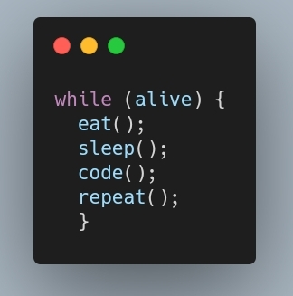

<h1 align="center">Hey 👋, I'm Abraham</h1>
<h3 align="center">A FullStack Web Developer</h3>

<i>- I'm a 17 years old teenager who likes to learn.
 - I enjoy working in a <b>team</b> and working on big projects.
 - I'm currently working at <b>NoobyMC</b>.
 - I'm a beginner in <b>Marketing</b> and <b>Communications</b>.
 - I enjoy creating <b>solutions</b> to problems that arise.
</i>
<!--

-->
<h3 align="left">Social networks</h3>

<h3 align="left">My knowledge</h3>

          

<h5>My portfolio</h5>

<h6><i>In process...</i></h6>

&nbsp;

<h6 align="left">Contact Me</h6>

<big>Send your message to me</big>

<h5 align="left">ifail90contact@gmail.com</h5>
